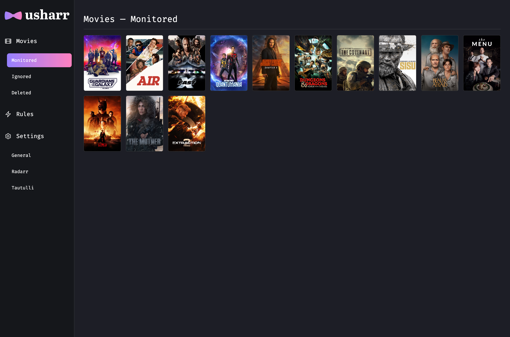
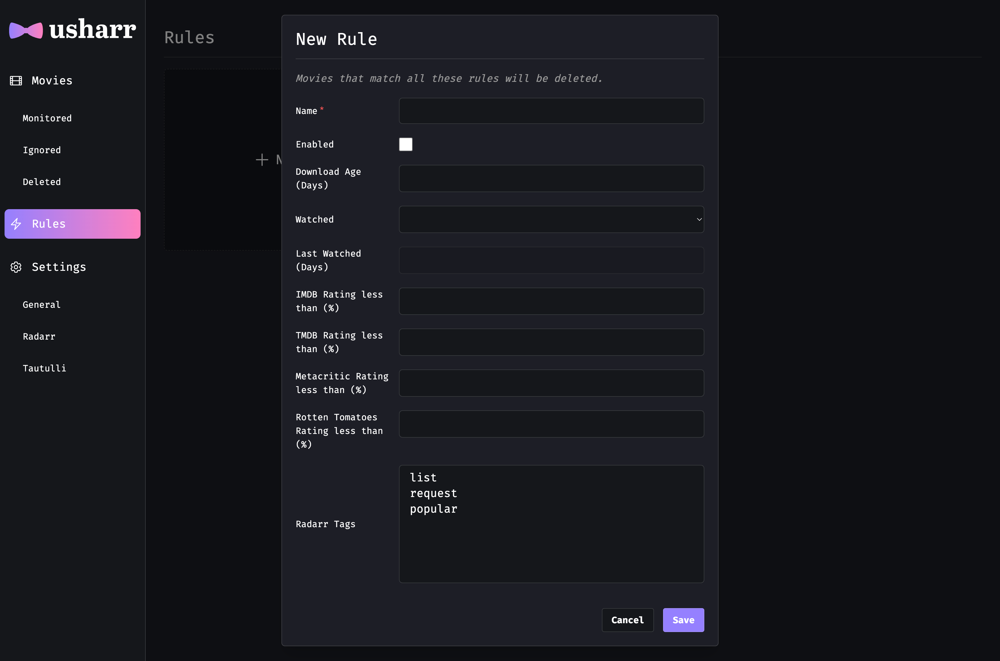

<picture>
  <source media="(prefers-color-scheme: dark)" srcset="./images/banner-dark.png">
  <source media="(prefers-color-scheme: light)" srcset="./images/banner-light.png">
  
</picture>

With **Usharr**, you can effortlessly maintain a streamlined movie library by removing unwanted movies based on your preferences and criteria. It integrates with your existing [Radarr](https://radarr.video) and [Tautulli](https://tautulli.com/) services and allows you to define specific rules for removing movies from your library.

[](https://github.com/nicholasodonnell/usharr/actions/workflows/cd.yml)

## Current Features

- **Watch status** — Delete movies that are watched or unwatched.
- **Last watched** — Delete movies that have not been watched after a certain amount of time.
- **Download Age** — Delete movies that have been downloaded after a certain amount of time (upgrades reset the download age).
- **IMDB Rating** — Delete movies with a low [IMDB](https://www.imdb.com/) rating.
- **TMDB Rating** — Delete movies with a low [The Movie Database](https://www.themoviedb.org/) rating.
- **Metacritic Rating** — Delete movies with a low [Metacritic](https://www.metacritic.com/) rating.
- **Rotten Tomatoes Rating** — Delete movies with a low [Rotten Tomatoes](https://www.rottentomatoes.com/) rating.
- **Tags** — Only monitor movies with specific tags in Radarr.
- **Ignore movies** — Mark individual movies as ignored so they are never deleted.
- **Full Radarr integration** — Fully syncs with your existing Radarr library. When a movie is removed by Usharr, the movie file is deleted from your library and excluded in Radarr.
- **Full Tautulli integration** — Fully syncs with your existing Tautulli instance. Watched movies are synced from Tautulli to Usharr so your rules stay up-to-date.

With more features on the way! Check out the [issues](https://github.com/nicholasodonnell/usharr/issues) to see the features which have already been requested. Pull requests are also welcome!

## Getting Started

> :exclamation: Be sure to replace `/path/to/config` in the below examples with a valid host directory path. The `TZ` environment variable value should also be set to the [TZ database name](https://en.wikipedia.org/wiki/List_of_tz_database_time_zones) of your time zone.

> :grey_exclamation: After running Usharr for the first time, configure it by visiting the web UI at `http://[address]:5588`.

#### Docker

```bash
docker run -d \
  -e TZ=America/New_York \
  -p 5588:5588 \
  -v /path/to/config:/config \
  --restart unless-stopped \
  nicholasodonnell/usharr:latest
```

#### Docker Compose

```yaml
version: '3'

services:
  usharr:
    image: nicholasodonnell/usharr:latest
    container_name: usharr
    environment:
      - TZ=America/New_York
    ports:
      - 5588:5588
    volumes:
      - /path/to/config:/config
    restart: unless-stopped
```

## Preview





## Development

1. `npm i`
2. `npm run db:generate`
3. `docker-compose up`
4. Navigate to [localhost:5588](http://localhost:3000)

### Generate migration

```bash
docker-compose run --rm -it app npm run db:migrate
```
